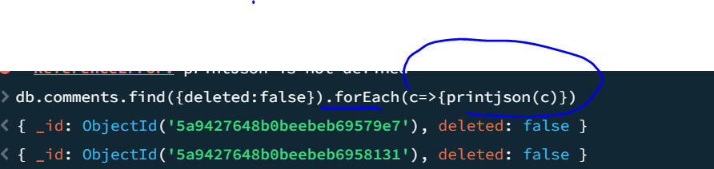
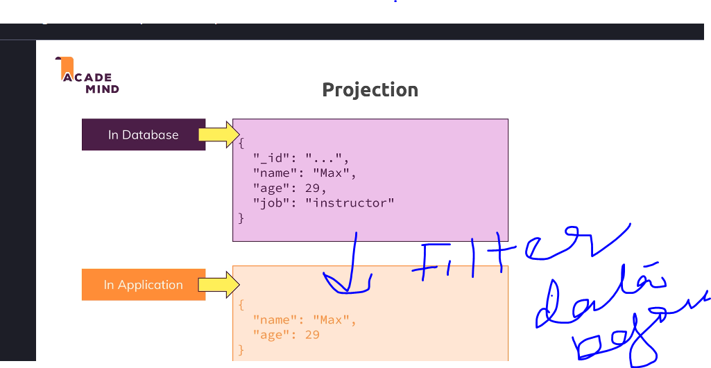
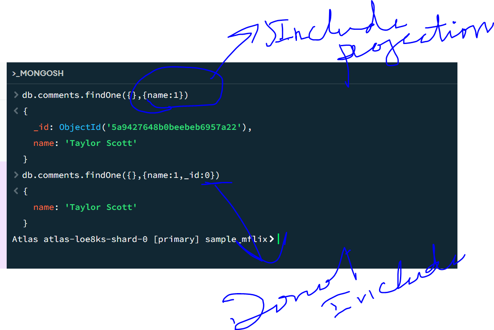

* does not have fixed schema and data is denomalized
* so mongodb can we used for projects that are evolving and data requirements are not set yet
* less relations better efficiency in fetching data
* they are good for read or write heavy apps

MONGO DB offerings
>on permise
>atlas
>Stich is serverless offering

Mongo Shell -you can run commands like show dbs will shows dbs in the shell

Bigger Picture


**********************************************************************
CRUD(CREATE/UPDATE/UPDATE/DELETE)

DATABASE HAS MULTIPLE COLLECTIONS and which has different documents 

db.version()
show dbs
db.comments.find({"name":"John Bishop"}).count();
****************************
```
JSON vs BSON(Binary JSON)```

JSON is converted into BSON by the drivers so that its efficient storage
Create-insertone(data,options),insertmany(data,options)
Read-find(filter,options),findOne(filter,options)
Update-updateOne(filter,data,options) UpdateMany(filter,data,options) replaceOne(filter,data,options)
Delete -DeleteOne(filter,options) deleteMany(filter,options)

```
$ sign is a reserved key work in MongoDb```

* db.comments.updateOne({name:"Selyse Baratheon"},{$set:{marker:"delete"}})
{
  _id: ObjectId('5a9427648b0beebeb6959421'),
  name: 'Selyse Baratheon',
  email: 'tara_fitzgerald@gameofthron.es',
  movie_id: ObjectId('573a1394f29313caabce0808'),
  text: 'Laudantium dolorem tenetur accusantium deleniti sint soluta. Ducimus blanditiis porro expedita laborum. Ut a esse vel odit ab tenetur magni. Odio numquam sapiente iste excepturi commodi et.',
  date: 1985-05-12T10:40:58.000Z,
  marker: 'delete'
}
* you are adding a field here marker:"delete" 
db.movies.findOne({year:{$gte:1970}})
* pretty is supported on find and not on FindOne
db.movies.find({year:{$gte:1970}}).pretty()


```Diff b/w update and updateMany```
* update replaces the entire mongo object just keeping the id same if we do not use $set but its deprecated now use replaceOne


```FIND command does not returns all objects but a cursor```
which makes lot of sense as your collection can have million rows we cannot return all of them in one go but some list


```To iterate and transform the list in the driver code we can do we can find exact syntax in driver docs```
db.collection("comments").find().foreach((comment)=>{printjson(comment)})


* REMEMBER - foreach does not loads everything in memory but does it on-demand 


```Projection```
* Filtering data at mongo db level and not sending it over the wire database must have mutiple columns but the app may not need all the columns so its wise to filter columns at the db level




```Drop Db and Collection```
To get rid of your data, you can simply load the database you want to get rid of (use databaseName) and then execute db.dropDatabase().

Similarly, you could get rid of a single collection in a database via db.myCollection.drop().

```Data Types in Mongo```
db.companies.insertOne({name:'ABC12', address:'MA', createdOn:new Date(), isStartUp:true, id:new Timestamp(),tags:[{flag:'happyemp'},{flag:'goodCompany'}]})

MongoDB has a couple of hard limits - most importantly, a single document in a collection (including all embedded documents it might have) must be <= 16mb. Additionally, you may only have 100 levels of embedded documents.
NumberInt creates a int32 value => NumberInt(55)

NumberLong creates a int64 value => NumberLong(7489729384792)

If you just use a number (e.g. insertOne({a: 1}), this will get added as a normal double into the database. The reason for this is that the shell is based on JS which only knows float/ double values and doesn't differ between integers and floats.


db.stats()-->give the size of db 
if there is strong one to one relationship we should go for embedded or nested documents

```Explain embedding vs. referencing in MongoDB.```

Embedding: nested documents within a single document
Referencing: storing related data in separate documents with references (similar to foreign keys)


```When would you choose embedding over referencing?```

One-to-few relationships
one to many embedding is when its a scenerio of question ans
one to many refrencing usecase is citizens and cities
Data that is queried together
Data that doesn't change frequently


Many to Many
Products<-->Customers
add references
db.person.updateMany(
  { name: "reetu" }, 
  { $set: { city: [ObjectId('67e7f8c64cdaad6073e223ef'), ObjectId('67e7f8c64cdaad6073e223f0')] } }
)
```Aggregate LookUp```
this is when we have different documents with refrences but want to lookup in one go

db.person.aggregate([
  {
    $lookup: {
      from: "city",
      localField: "city",
      foreignField: "_id",
      as: "cityDetails"
    }
  }
])
```What are MongoDB operators? Give examples of commonly used ones.```

* $eq, $gt, $lt (comparison)
@ $and, $or, $not (logical)
$set, $inc, $push (update)
$match, $group, $project (aggregation)
```How do you monitor query performance in MongoDB?```

Using explain() method to analyze query execution
Profiler to capture slow queries
MongoDB Compass or monitoring tools


```What is sharding and when would you use it?```

Horizontal scaling strategy distributing data across multiple servers
Used for very large datasets and high throughput applications

```How would you optimize a slow-performing MongoDB query?```

* Create appropriate indexes
* Use projection to return only needed fields
* Restructure the query or data model if necessary
* Use explain() to analyze execution plan

```Validating Schema in Mongo Db```
db.createCollection("postwithvalid", {
  validator: {
    $jsonSchema: {
      bsonType: "object",
      required: ['postName', 'type'],
      properties: {
        postName: {
          bsonType: "string",
          description: "must be a string and is required"
        },
        type: {
          bsonType: "string",
          description: "must be a string and is required"
        }
      }
    }
  }
})
# MongoDB Operators Overview

## Types of Operators

### Query Operators
- Allow us to narrow down the set of documents retrieved
- Example: `$gt` (greater than)
- Used for locating data
- Do not change data in the database
- Other examples: `$eq` (equals)

### Projection Operators
- Allow us to transform or change the data we get back
- Only modify the presentation of data, not the data in the database
- Example: `$` operator
- Control the appearance of returned data

### Update Operators
- Used for updating fields and arrays in documents
- Will be covered in the Update module
- Do change data in the database
- Example: `$inc` - increments a field by specified amount


### Aggregation
- More complex transforms for reading data
- Sets up a pipeline of stages to funnel data through
- Provides operators to shape returned data
- Will be covered in a separate Aggregation module

## Module Focus
- Current module: Read operators (Query and Projection)
- Update module: Update operators
- No special operators for inserts
- Delete uses the same operators as read (to find data to delete)

## Summary by Function

| Operator Type | Purpose | Changes Database | Examples | Coverage |
|---------------|---------|------------------|----------|----------|
| Query | Locate data | No | `$eq`, `$gt` | Current module |
| Projection | Modify data presentation | No | `$` | Current module |
| Update | Modify/add data | Yes | `$inc` | Update module |
| Aggregation | Complex data transforms | No | Various | Aggregation module |