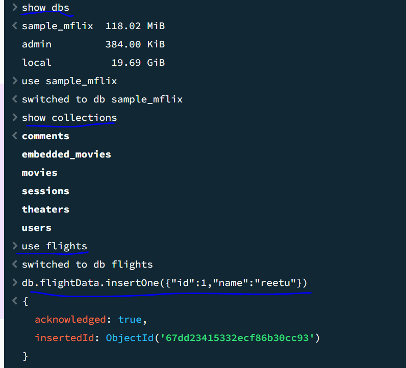
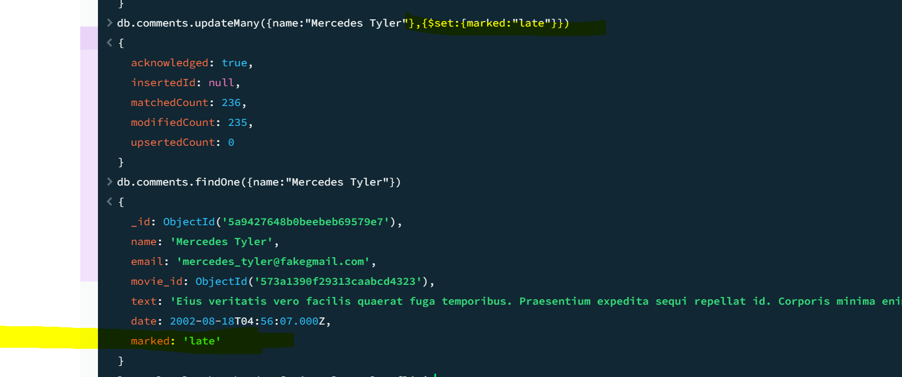
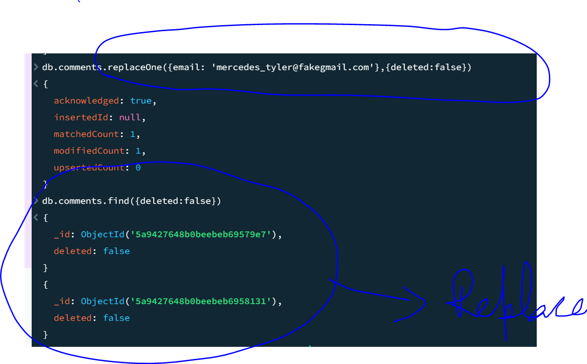
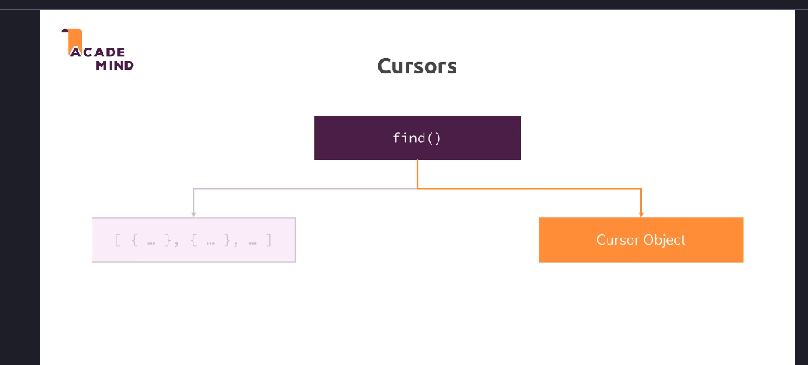

* does not have fixed schema and data is denomalized
* so mongodb can we used for projects that are evolving and data requirements are not set yet
* less relations better efficiency in fetching data
* they are good for read or write heavy apps

MONGO DB offerings
>on permise
>atlas
>Stich is serverless offering

Mongo Shell -you can run commands like show dbs will shows dbs in the shell

Bigger Picture


**********************************************************************
CRUD(CREATE/UPDATE/UPDATE/DELETE)

DATABASE HAS MULTIPLE COLLECTIONS and which has different documents 

db.version()
show dbs
db.comments.find({"name":"John Bishop"}).count();
****************************
```
JSON vs BSON(Binary JSON)```

JSON is converted into BSON by the drivers so that its efficient storage
Create-insertone(data,options),insertmany(data,options)
Read-find(filter,options),findOne(filter,options)
Update-updateOne(filter,data,options) UpdateMany(filter,data,options) replaceOne(filter,data,options)
Delete -DeleteOne(filter,options) deleteMany(filter,options)

```
$ sign is a reserved key work in MongoDb```

* db.comments.updateOne({name:"Selyse Baratheon"},{$set:{marker:"delete"}})
{
  _id: ObjectId('5a9427648b0beebeb6959421'),
  name: 'Selyse Baratheon',
  email: 'tara_fitzgerald@gameofthron.es',
  movie_id: ObjectId('573a1394f29313caabce0808'),
  text: 'Laudantium dolorem tenetur accusantium deleniti sint soluta. Ducimus blanditiis porro expedita laborum. Ut a esse vel odit ab tenetur magni. Odio numquam sapiente iste excepturi commodi et.',
  date: 1985-05-12T10:40:58.000Z,
  marker: 'delete'
}
* you are adding a field here marker:"delete" 
db.movies.findOne({year:{$gte:1970}})
* pretty is supported on find and not on FindOne
db.movies.find({year:{$gte:1970}}).pretty()



```Diff b/w update and updateMany```
* update replaces the entire mongo object just keeping the id same if we do not use $set but its deprecated now use replaceOne



```FIND command does not returns all objects but a cursor```
which makes lot of sense as your collection can have million rows we cannot return all of them in one go but some list


```Explain embedding vs. referencing in MongoDB.```

Embedding: nested documents within a single document
Referencing: storing related data in separate documents with references (similar to foreign keys)


```When would you choose embedding over referencing?```

One-to-few relationships
Data that is queried together
Data that doesn't change frequently
```What are MongoDB operators? Give examples of commonly used ones.```

* $eq, $gt, $lt (comparison)
@ $and, $or, $not (logical)
$set, $inc, $push (update)
$match, $group, $project (aggregation)
```How do you monitor query performance in MongoDB?```

Using explain() method to analyze query execution
Profiler to capture slow queries
MongoDB Compass or monitoring tools


```What is sharding and when would you use it?```

Horizontal scaling strategy distributing data across multiple servers
Used for very large datasets and high throughput applications

```How would you optimize a slow-performing MongoDB query?```

* Create appropriate indexes
* Use projection to return only needed fields
* Restructure the query or data model if necessary
* Use explain() to analyze execution plan

