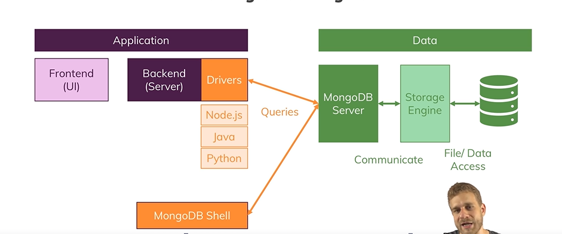

* does not have fixed schema and data is denomalized
* so mongodb can we used for projects that are evolving and data requirements are not set yet
* less relations better efficiency in fetching data
* they are good for read or write heavy apps

MONGO DB offerings
>on permise
>atlas
>Stich is serverless offering

Mongo Shell -you can run commands like show dbs will shows dbs in the shell

Bigger Picture

**********************************************************************
CRUD(CREATE/UPDATE/UPDATE/DELETE)

DATABASE HAS MULTIPLE COLLECTIONS and which has different documents 

db.version()
show dbs
db.comments.find({"name":"John Bishop"}).count();
****************************
JSON vs BSON(Binary JSON)
JSON is converted into BSON by the drivers so that its efficient storage
Create-insertone(data,options),insertmany(data,options)
Read-find(filter,options),findOne(filter,options)
Update-updateOne(filter,data,options) UpdateMany(filter,data,options) replaceOne(filter,data,options)
Delete -DeleteOne(filter,options) deleteMany(filter,options)

$ sign is a reserved key work in MongoDb
db.comments.updateOne({name:"Selyse Baratheon"},{$set:{marker:"delete"}})
{
  _id: ObjectId('5a9427648b0beebeb6959421'),
  name: 'Selyse Baratheon',
  email: 'tara_fitzgerald@gameofthron.es',
  movie_id: ObjectId('573a1394f29313caabce0808'),
  text: 'Laudantium dolorem tenetur accusantium deleniti sint soluta. Ducimus blanditiis porro expedita laborum. Ut a esse vel odit ab tenetur magni. Odio numquam sapiente iste excepturi commodi et.',
  date: 1985-05-12T10:40:58.000Z,
  marker: 'delete'
}
you are adding a field here marker:"delete" 
db.movies.findOne({year:{$gte:1970}})